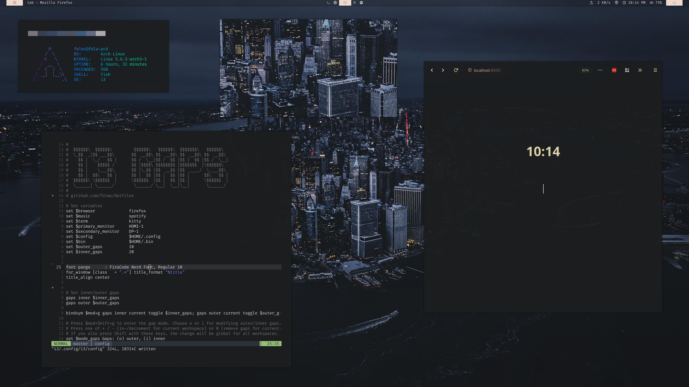
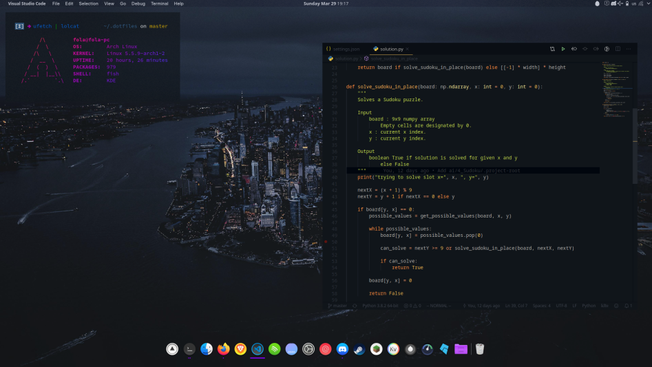

# folws's dotfiles


> The current state of this repository is for backup only. Most scripts
> will not work on your system.

This repository consists of configuration for any tools I use within my [Arch Linux][arch] and [neovim][] development environment.
I use a *lot* of tools which culminate in a sort of Unix IDE,
I use [dotdrop] to install link all of the required configuration into my home directory.

## Preview

##

+ wm: kde-plasma
+ terminal: konsole
+ shell: fish
+ font: Source Code Pro
+ bar/dock: latte-dock
|          |                           |
|----------|---------------------------|
| wm       | i3-gaps                   |
| terminal | kitty                     |
| shell    | fish                      |
| font     | Fira Code Nerd Font Patch |
| bar      | polybar                   |

## Overview
- [Requirements](#requirements)
- [Quick Start](#quick-start)
- [Dots](#dots)
- [Screenshots](#screenshots)
- [License](#unlicense)

## Requirements

### GNU/stow
> If planning to use stow to manage the (symlinked) dots

Your distribution repositories is very likely to contain `stow`, for example in Arch Linux, all you have to do to install it is:
`sudo pacman -S stow`
or on Ubuntu/Debian you can install stow by executing:
`apt install stow`

## Rice-insallation

### Install & Update Script
To **install** or **update** configs on your system, you should run the [install_script][]. To do that, you may either download and run the script manually, or use the following cURL or Wget command:
```sh
curl -sL https://raw.githubusercontent.com/folws/dotfiles/master/bootstrap | bash
```

```sh
wget -qO- https://raw.githubusercontent.com/folws/dotfiles/master/bootstrap | bash
```

## Dots (WIP)

### Anne Pro 2
Holds the light profiles and keymaps for my Anne pro keyboard

### Firefox
A browser where being fast is not an understatement

#### userChrome
Based upon [mut-ex]'s minimal-functional-firefox but cleaned up and aware of colors generated by pywal in `.Xresources`. Also added is an auto hiding tabbar with reduced tab sizes to have a more minimal UI.

##### Startpage
Modified version of KorySchneider's tab [Github][tab].

#### Polybar
My config is a modified Polybar-4 by adi1090x. - [GitHub][adi1090x]

### Neovim
No editor is as extensible, easy to use as Vim is. But standard Vim ... TODO

#### Keymaps
Using the (`ctrl/shift`) + `enter`keybinds in term vim requires special keycodes that vim expects to be sent by your terminal.
Depending on your terminal,

[iTerm2]
For a single Profile open Preferences → Profiles → Keys → [+] (Add)
For all profiles open Preferences → Keys → [+] (Add)
  - Keyboard shortcut: (Hit Shift+Enter)
  - Action: Send Escape Sequence
  - Esc+ ``[13;2u``
  - Repeat for Ctrl+Enter, with sequence: ``[13;5u``

[urxvt], append to your .Xresources file:
```Xresources
URxvt.keysym.S-Return:     \033[13;2u
URxvt.keysym.C-Return:     \033[13;5u
```

[Alacritty], under key_bindings, add following to your ~/.config/alacritty/alacritty.yml:
```yaml
- { key: Return,   mods: Shift,   chars: "\x1b[13;2u" }
- { key: Return,   mods: Control, chars: "\x1b[13;5u" }
```

Kitty, in ~/.config/kitty/kitty.conf:
```conf
map shift+enter send_text all \x1b[13;2u
map ctrl+enter send_text all \x1b[13;5u
```

## Unlicensed

This are my personal dots so do what you want.
Find the full [unlicense][] in the `UNLICENSE` file, but here's a snippet.

>This is free and unencumbered software released into the public domain.
>
>Anyone is free to copy, modify, publish, use, compile, sell, or distribute this software, either in source code form or as a compiled binary, for any purpose, commercial or non-commercial, and by any means.

Do what you want. Learn as much as you can. Unlicense more software.

[install_script]: https://raw.githubusercontent.com/folws/dotfiles/master/install
[unlicense]: http://unlicense.org/
[arch]: https://www.archlinux.org/
[stow]: http://www.gnu.org/software/stow/
[yay]: https://github.com/Jguer/yay
[aur]: https://aur.archlinux.org/
[picom]: https://wiki.archlinux.org/index.php/Picom
[fish]: http://fishshell.com/
[neovim]: https://neovim.io/
[dotdrop]: https://github.com/deadc0de6/dotdrop
[mut-ex]: https://github.com/mut-ex/minimal-functional-fox
[tab]: https://github.com/folws/tab
[adi1090x]: https://github.com/adi1090x/polybar-themes
[urxvt]: http://software.schmorp.de/pkg/rxvt-unicode.html
[iTerm2]: https://www.iterm2.com/
[Kitty]: https://sw.kovidgoyal.net/kitty/
[Alacritty]: https://github.com/alacritty/alacritty

